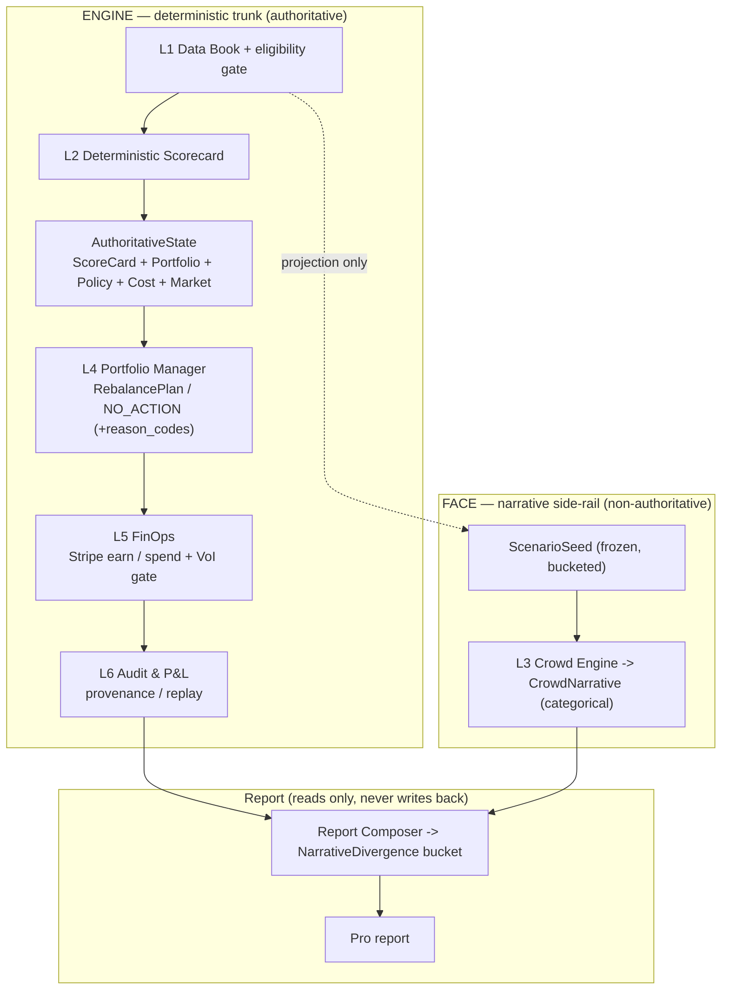

# StackFund Architecture (Core-B, arch-v2)

> Autonomous Taiwan ETF **research desk** — a Hermes agent that **earns**, **spends**,
> and **runs real operations**, with a deterministic engine and a strictly
> firewalled narrative face.
>
> **One-sentence contract:** the engine decides from evidence; the crowd engine
> explains possible reactions, but can never vote on the portfolio. StackFund is a
> research desk — **it places no securities orders.**

A Chinese version of this document: [ARCHITECTURE.zh-TW.md](ARCHITECTURE.zh-TW.md).

---

## 1. Two halves: ENGINE (authoritative) + FACE (non-authoritative)

- **ENGINE** — a deterministic Python trunk that **computes every number**
  (`L1 → L2 → L4 → L5 → L6`). The "steering wheel".
- **FACE** — the `L3` crowd scenario engine. **Narrative only.** It reads a frozen,
  bucketed projection of the data and emits a *categorical* crowd stance. It never
  decides a number, never influences an action, and never writes back to a decision.



**Firewall:** there is **no edge from FACE into the ENGINE decision path.** L4/L5 do
not import L3, either FACE artifact, or the report module (see §3).

---

## 2. The L4 decision: `AuthoritativeState`, not "ScoreCard only"

A ScoreCard says *whether an ETF is good*; it cannot alone answer *how much to hold
right now*. So L4 consumes a full **`AuthoritativeState`**:

| Field | What it carries |
|---|---|
| `ScoreCard` | transparent sub-scores (trend / valuation / yield / catalyst / risk) + eligibility |
| `PortfolioState` | current holdings, cash weight |
| `PolicySet` | tolerance, max weight, min cash, max delta per run, tilt |
| `CostModel` | broker fee + transaction tax + slippage (bps) |
| `MarketState` | session, as-of |

`build_rebalance_plan(state: AuthoritativeState) -> RebalancePlan`. Decision order:

1. **Ineligible** (failed the L2 gate) → `NO_ACTION` `[INELIGIBLE, …gate reasons]`
2. target weight = `equal_weight + conviction·tilt`, clamped by policy → `delta = target − current`
3. **Within tolerance** (`|delta| < tolerance`) → `NO_ACTION` `[WITHIN_TOLERANCE]`
4. **Not worth it** (`expected_benefit_bps < round_trip_cost_bps`) → `NO_ACTION`
   `[EXPECTED_BENEFIT_BELOW_TRANSACTION_COST]`
5. otherwise → `REBALANCE` with the clamped delta + ≥2 independent hard reasons

`NO_ACTION` is a **first-class** output with machine-readable `reason_codes` and an
`authoritative_input_hash` (so every decision is replayable). The cost-vs-benefit
gate is the strongest "is it really reasoning?" signal: a big weight gap with weak
conviction is **declined** because the trade is not worth the cost.

---

## 3. The firewall — structural and machine-checked

The crowd side is firewalled out of the decision path three ways (all enforced in CI):

1. **import-linter** (`pyproject.toml`): `forbidden` contracts — `l4_portfolio` &
   `l5_finops` may not import `l3_crowd`, `contracts.crowd_narrative`,
   `contracts.narrative_divergence`, or `report` (catches transitive imports). Plus a
   `layers` contract: `L4 → L2 → L1` downward only.
2. **ast import-graph test** (`tests/test_firewall_no_imports.py`): scans every L4/L5
   `*.py` for the forbidden tokens — a fast, zero-dependency belt.
3. **signature guard** (`tests/test_l4_signature.py`): asserts the L4 entrypoint takes
   only `AuthoritativeState`, never a FACE type.

Design detail: `contracts/__init__.py` deliberately does **not** re-export the FACE
artifacts, so importing the contracts facade can't pull them in transitively.

> Even under prompt-injection, the worst L3 can do is produce a vivid-but-wrong
> *story* — it is not wired to any decision or calculation, so it does **zero** damage
> to any computed number or any action.

---

## 4. FACE: categorical, no scalar

The old `contrarian_modifier ∈ [-1,+1]` was deleted: a continuous scalar named
"signal/modifier" invites "just add 0.05 to the sort" architecture rot. Instead:

- **L3 emits `CrowdNarrative`** — a *categorical* `crowd_consensus`
  (`bearish | neutral | bullish`) + narrative + synthetic persona samples. **No
  numeric field**, hard-wired `non_authoritative = true`, `synthetic_population = true`.
- The **Report Composer** computes **`NarrativeDivergence`** = crowd vs. engine posture
  → a bucket `LOW | MEDIUM | HIGH` + `narrative_intensity ∈ {1,2,3}`. The engine
  posture is read here (not in L3 — L3 is firewalled from the engine), so the
  divergence is produced *at report time* and never flows back to a decision.

L3 has no tools, no network, no write access; the persona pool is version-pinned
(`seed.lock.json`, fixed RNG seed). Wording is "**synthetic persona scenario
distribution, not a real market survey**".

---

## 5. Three ledgers — never conflated

A Stripe test charge is **business FinOps**, never "ETF investment P&L". Kept separate
in `ledgers.py`:

| Ledger | Contents | Note |
|---|---|---|
| **Portfolio Ledger** | simulated ETF allocation from `RebalancePlan` | `simulated=true` — research illustration, **NOT orders/fills** |
| **FinOps Ledger** | Stripe revenue + SaaS/API expenses + Operational P&L | the **business**, not the ETFs |
| **Experiment Ledger** | `run_id`, `parent_run_id`, seed, versions | replay metadata |

**VoI cross-run rule:** a run's inputs are immutable and hashed. When the
Value-of-Information gate decides to buy data, that is an **ExpenseReceipt in run N**;
the new data only feeds **run N+1**'s fresh DataBook. Never mutate a DataBook/ScoreCard
mid-run — otherwise replay can't reproduce what the agent saw at decision time.

---

## 6. Data contracts (JSON-schema-validated)

| Contract | Module | Schema | Notes |
|---|---|---|---|
| `DataBook` | `contracts/databook.py` | — | immutable, `book_hash`; raw numbers live only here |
| `ScenarioSeed` | `contracts/scenario_seed.py` | `scenario_seed.schema.json` | bucketed ordinal only — no raw numbers cross to L3 |
| `ScoreCard` | `contracts/scorecard.py` | (in `etf_research_report`) | sub-scores + `eligible` + `gate_reasons` |
| `AuthoritativeState` | `contracts/authoritative_state.py` | — | the only L4 input; `input_hash()` |
| `RebalancePlan` | `contracts/rebalance_plan.py` | `rebalance_plan.schema.json` | `reason_codes`, no crowd field |
| `CrowdNarrative` | `contracts/crowd_narrative.py` | `crowd_narrative.schema.json` | categorical; no numeric modifier |
| `NarrativeDivergence` | `contracts/narrative_divergence.py` | `narrative_divergence.schema.json` | LOW/MEDIUM/HIGH bucket |
| `OperationalReceipt` | `contracts/finops.py` | `operational_receipt.schema.json` | earn/spend/refused/blocked |

All crowd/report schemas hard-wire `non_authoritative: true` and contain **no**
price/NAV/yield/weight/cap field anywhere.

---

## 7. Surfaces — CLI, web app, and standing research

The same deterministic engine drives three surfaces; none of them can move a number
the engine didn't compute.

- **CLI** (`cli.py`, the composition root): `pipeline` (full `L1→L6` run, `--json` or text),
  `crowd` (L3 FACE only, dry-run default), `verify` (determinism), `desk` (a static HTML
  research-desk render), `journal` (append one dated decision to the standing research journal).
- **Web app** (`ui/server.py`, a dependency-free stdlib server) — the buy→use→ops journey:
  `/pricing` (3 plans, **USD $20 / $100**) → Stripe TEST-mode Checkout → `/success`
  (server-verified `paid`; sets a subscribed cookie → a `✓ subscribed` banner) → `/` (chat:
  one real agent turn per message, runs the skills + engine under `SOUL.md`) → `/finops` (the
  monthly operating P&L + a P&L bar chart + the VoI gate + the receipts ledger) → `/journal`
  (the standing weekly plan). Every page is **bilingual EN / 中** (cookie-persisted `?lang=`
  + a `STR` table localized at render time). The app is **presentation only** — it shells out
  to `python -m stackfund` and recomputes nothing; `report/desk.py` renders, the engine decides.
- **Standing research (long-term planning)**: `python -m stackfund journal` runs the same
  deterministic pipeline on a schedule (Hermes cron, or a host scheduler — `docker/setup-cron.sh`)
  and accumulates `.hermes-data/research-journal.jsonl`, surfaced at `/journal`. The desk
  operates continuously, not only when asked.

---

## 8. Deployment: Docker ⊂ OpenShell ⊂ NemoClaw

```
StackFund agent (Hermes harness + skills + engine)
   ↓ packaged as     docker/Dockerfile.agent
Docker / OCI image
   ↓ launched by      policy/openshell.yaml   (Landlock + seccomp + netns + L7 egress proxy)
OpenShell sandbox
   ↓ orchestrated by  policy/nemoclaw-blueprint.yaml
NemoClaw (onboard, blueprint, inference routing)
```

The deterministic-core image (`docker/Dockerfile.core`) runs with **zero egress**
(`--network none`); the agent image talks to a Hermes model (provider auto-detected
from a key in `.hermes-data/.env`) through an allowlisting proxy. Secrets are injected
at runtime, never baked into a layer.

---

## 9. Deferred / open

- **L5A "execution" layer (open decision, pending review):** an architecture review
  proposed a paper-broker execution layer emitting `OrderReceipt`/`FillReceipt`. We
  **adopted the ledger separation but not the execution vocabulary** — introducing
  "orders/fills" (even paper) would drift the product from a *research desk
  (no securities orders)* toward a *trading agent*, which is the carefully chosen
  regulatory safe-harbor framing (SITA §4 / SEA §155). To revisit only with counsel.
- DB-role permission isolation (FACE DB role cannot write ENGINE schema) — a
  production hardening on top of today's import-graph + container/network isolation.

---

## 10. Module map

```
src/stackfund/
├── contracts/            authoritative_state, scorecard, rebalance_plan, portfolio,
│                         policy, costs, market, databook, scenario_seed, finops,
│                         provenance, crowd_narrative*, narrative_divergence*   (* = FACE)
├── l1_databook/          ingest + frozen ScenarioSeed projection
├── l2_scorecard/         eligibility gate + transparent scorecard
├── l4_portfolio/         build_rebalance_plan(AuthoritativeState)
├── l5_finops/            Stripe earn/spend/refused + VoI gate
├── l6_audit/             decision + crowd-report provenance
├── l3_crowd/             CrowdNarrative (FACE, firewalled)
├── report/               Report Composer -> NarrativeDivergence (reads-only) + desk.py (static HTML)
├── ledgers.py            Portfolio / FinOps / Experiment ledgers
└── cli.py                composition root (pipeline / crowd / verify / desk / journal)
```

The **web app** lives outside the package at `ui/server.py` (stdlib, shells to the CLI;
buy→use→ops, bilingual). Run it: `uv run python -m stackfund pipeline` · the app
`bash docker/run-chat-ui.sh` · tests `uv run pytest -q` · firewall `uv run lint-imports`.
