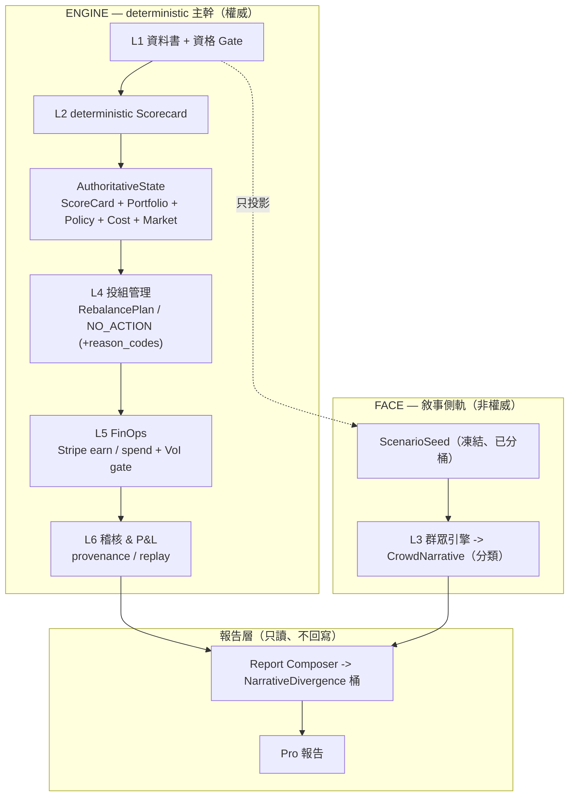

# StackFund 架構說明（Core-B, arch-v2）

> 自主經營的台股 ETF **研究台** —— 一個會 **賺錢**、**花錢**、**跑真實營運** 的 Hermes 代理;
> 由 deterministic 引擎決策,門面為被嚴格防火牆隔離的敘事側軌。
>
> **一句話契約:** 引擎依證據決策;群眾引擎只解釋可能反應,**永遠不能對投資組合投票**。
> StackFund 是研究台 —— **全程不下任何證券委託單。**

English version of this document: [ARCHITECTURE.md](ARCHITECTURE.md)。

---

## 1. 兩半:ENGINE(權威)+ FACE(非權威)

- **ENGINE** —— deterministic Python 主幹,**算出每一個數字**(`L1 → L2 → L4 → L5 → L6`)。方向盤。
- **FACE** —— `L3` 群眾情境引擎。**只產敘事。** 它只讀「已分桶、凍結」的資料投影,輸出一個**分類**的群眾傾向。
  不決定任何數字、不影響任何動作、不回寫任何決策。



**防火牆:** 從 FACE 到 ENGINE 決策路徑**沒有任何一條邊**。L4/L5 不 import L3、兩個 FACE
artifact、或 report 模組(見 §3)。

---

## 2. L4 決策:吃 `AuthoritativeState`,不是「只吃 ScoreCard」

ScoreCard 只說「這檔 ETF 好不好」,單獨無法回答「**現在該持有多少**」。所以 L4 吃一份完整的
**`AuthoritativeState`**:

| 欄位 | 內容 |
|---|---|
| `ScoreCard` | 透明子分數(trend / valuation / yield / catalyst / risk)+ 資格旗標 |
| `PortfolioState` | 現有持倉、現金權重 |
| `PolicySet` | 容差、單檔權重上限、現金下限、每 run 最大變動、tilt |
| `CostModel` | 手續費 + 證交稅 + 滑價(bps) |
| `MarketState` | 盤別、時點 |

`build_rebalance_plan(state: AuthoritativeState) -> RebalancePlan`。決策順序:

1. **不合格**(沒過 L2 Gate)→ `NO_ACTION` `[INELIGIBLE, …gate 原因]`
2. 目標權重 = `等權 + 信念·tilt`,經 policy clamp → `delta = target − current`
3. **在容差內**(`|delta| < tolerance`)→ `NO_ACTION` `[WITHIN_TOLERANCE]`
4. **不值得做**(`預期效益bps < 來回交易成本bps`)→ `NO_ACTION`
   `[EXPECTED_BENEFIT_BELOW_TRANSACTION_COST]`
5. 否則 → `REBALANCE`(clamp 後的 delta + ≥2 個獨立硬理由）

`NO_ACTION` 是**一級輸出**,帶機器可讀的 `reason_codes` 與 `authoritative_input_hash`
(每個決策都可重播)。其中「成本 vs 效益」是最強的「它是不是真的在推理」訊號:
**權重缺口很大但信念很弱 → 因為交易不划算而拒絕。**

---

## 3. 防火牆 —— 結構性、機器可檢

群眾側被三種方式擋在決策路徑外(全部在 CI 強制):

1. **import-linter**(`pyproject.toml`):`forbidden` 契約 —— `l4_portfolio` 與
   `l5_finops` 不得 import `l3_crowd`、`contracts.crowd_narrative`、
   `contracts.narrative_divergence`、`report`(會抓**間接** import)。另有 `layers` 契約:
   `L4 → L2 → L1` 只能向下。
2. **ast import-graph 測試**(`tests/test_firewall_no_imports.py`):掃描每個 L4/L5 的
   `*.py` 是否出現禁用 token —— 快速、零依賴的保險。
3. **簽章守門**(`tests/test_l4_signature.py`):斷言 L4 入口只接 `AuthoritativeState`,
   永不接 FACE 型別。

設計細節:`contracts/__init__.py` **刻意不 re-export** FACE artifact,讓「import contracts 門面」
也無法間接把 FACE 帶進來。

> 即使 L3 內遭 prompt-injection,最多產出生動但錯的**故事** —— 它根本沒接到任何決策或計算,
> 對任何已計算數字與任何動作造成**零**損害。

---

## 4. FACE:分類,不用純量

舊的 `contrarian_modifier ∈ [-1,+1]` 已刪除:一個叫「signal/modifier」的連續純量,本身就誘發
「反正加 0.05 到排序」這種架構腐化。改成:

- **L3 輸出 `CrowdNarrative`** —— 一個**分類**的 `crowd_consensus`
  (`bearish | neutral | bullish`)+ 敘事 + 合成人格樣本。**無任何數字欄位**,硬寫
  `non_authoritative = true`、`synthetic_population = true`。
- **Report Composer** 算出 **`NarrativeDivergence`** = 群眾 vs 引擎立場 → 桶
  `LOW | MEDIUM | HIGH` + `narrative_intensity ∈ {1,2,3}`。引擎立場在這裡才讀
  (不在 L3 —— L3 被防火牆隔離於引擎),所以 divergence 在**報告時**才產生,且永不回流決策。

L3 無工具、無網路、無寫入權限;人格庫版控(`seed.lock.json`、固定 RNG seed)。
用詞一律「**合成人格情境分布,不代表真實市場調查**」。

---

## 5. 三本帳 —— 永不混為一談

一筆 Stripe 測試收款是**事業 FinOps**,絕不是「ETF 投資損益」。在 `ledgers.py` 分離:

| 帳本 | 內容 | 註記 |
|---|---|---|
| **Portfolio Ledger** | 由 `RebalancePlan` 來的模擬 ETF 配置 | `simulated=true` —— 研究示意,**非下單/成交** |
| **FinOps Ledger** | Stripe 收入 + SaaS/API 支出 + 營運 P&L | **事業**,不是 ETF |
| **Experiment Ledger** | `run_id`、`parent_run_id`、seed、版本 | replay 元資料 |

**VoI 跨 run 規則:** 一個 run 的輸入是 immutable 且 hash 過的。當 Value-of-Information gate
決定買資料,那是 **run N 的 ExpenseReceipt**;新資料只餵 **run N+1** 的全新 DataBook。
**絕不在 run 中途改 DataBook/ScoreCard** —— 否則 replay 無法重現決策當下看到了什麼。

---

## 6. 資料契約（JSON schema 驗證）

| 契約 | 模組 | Schema | 註記 |
|---|---|---|---|
| `DataBook` | `contracts/databook.py` | — | immutable、`book_hash`;原始數字只在這裡 |
| `ScenarioSeed` | `contracts/scenario_seed.py` | `scenario_seed.schema.json` | 只有分桶 ordinal —— 原始數字不過河給 L3 |
| `ScoreCard` | `contracts/scorecard.py` | (在 `etf_research_report`) | 子分數 + `eligible` + `gate_reasons` |
| `AuthoritativeState` | `contracts/authoritative_state.py` | — | L4 唯一輸入;`input_hash()` |
| `RebalancePlan` | `contracts/rebalance_plan.py` | `rebalance_plan.schema.json` | `reason_codes`,無群眾欄位 |
| `CrowdNarrative` | `contracts/crowd_narrative.py` | `crowd_narrative.schema.json` | 分類;無數字 modifier |
| `NarrativeDivergence` | `contracts/narrative_divergence.py` | `narrative_divergence.schema.json` | LOW/MEDIUM/HIGH 桶 |
| `OperationalReceipt` | `contracts/finops.py` | `operational_receipt.schema.json` | earn/spend/refused/blocked |

所有群眾/報告 schema 硬寫 `non_authoritative: true`,且**全 schema 不存在**
price/NAV/yield/weight/cap 欄位。

---

## 7. 部署:Docker ⊂ OpenShell ⊂ NemoClaw

```
StackFund 代理（Hermes harness + skills + engine）
   ↓ 打包成     docker/Dockerfile.agent
Docker / OCI image
   ↓ 由…啟動    policy/openshell.yaml  （Landlock + seccomp + netns + L7 egress proxy）
OpenShell 沙盒
   ↓ 由…編排    policy/nemoclaw-blueprint.yaml
NemoClaw（onboard、blueprint、inference routing）
```

deterministic 主幹 image(`docker/Dockerfile.core`)以 **零 egress**(`--network none`)執行;
代理 image 透過 allowlist proxy 連 Hermes 模型(provider 由 `.hermes-data/.env` 的 key
自動偵測)。機密一律執行期注入,絕不烙進映像層。

---

## 8. 暫緩 / 未決

- **L5A「執行層」(未決,待 review 拍板):** 一份架構 review 建議加一個 paper-broker 執行層、
  輸出 `OrderReceipt`/`FillReceipt`。我們**採納分帳分離,但不採執行語意** —— 引入
  「下單/成交」(就算 paper)會把產品從**研究台(不下證券單)**漂移成**交易 agent**,
  那是我們刻意選的法規安全港(投顧法 §4 / 證交法 §155)。要重啟須先取得法律顧問意見。
- DB-role 權限隔離(FACE DB role 不能寫 ENGINE schema)—— 在今天的 import-graph + 容器/網路
  隔離之上的 production 硬化。

---

## 9. 模組地圖

```
src/stackfund/
├── contracts/            authoritative_state, scorecard, rebalance_plan, portfolio,
│                         policy, costs, market, databook, scenario_seed, finops,
│                         provenance, crowd_narrative*, narrative_divergence*   (* = FACE)
├── l1_databook/          擷取 + 凍結 ScenarioSeed 投影
├── l2_scorecard/         資格 Gate + 透明 scorecard
├── l4_portfolio/         build_rebalance_plan(AuthoritativeState)
├── l5_finops/            Stripe earn/spend/refused + VoI gate
├── l6_audit/             決策 + 群眾報告 provenance
├── l3_crowd/             CrowdNarrative（FACE,被防火牆隔離）
├── report/               Report Composer -> NarrativeDivergence（只讀）
├── ledgers.py            Portfolio / FinOps / Experiment 三本帳
└── cli.py                composition root（pipeline / crowd / verify）
```

執行:`uv run python -m stackfund pipeline` · 測試 `uv run pytest -q` · 防火牆
`uv run lint-imports`。
