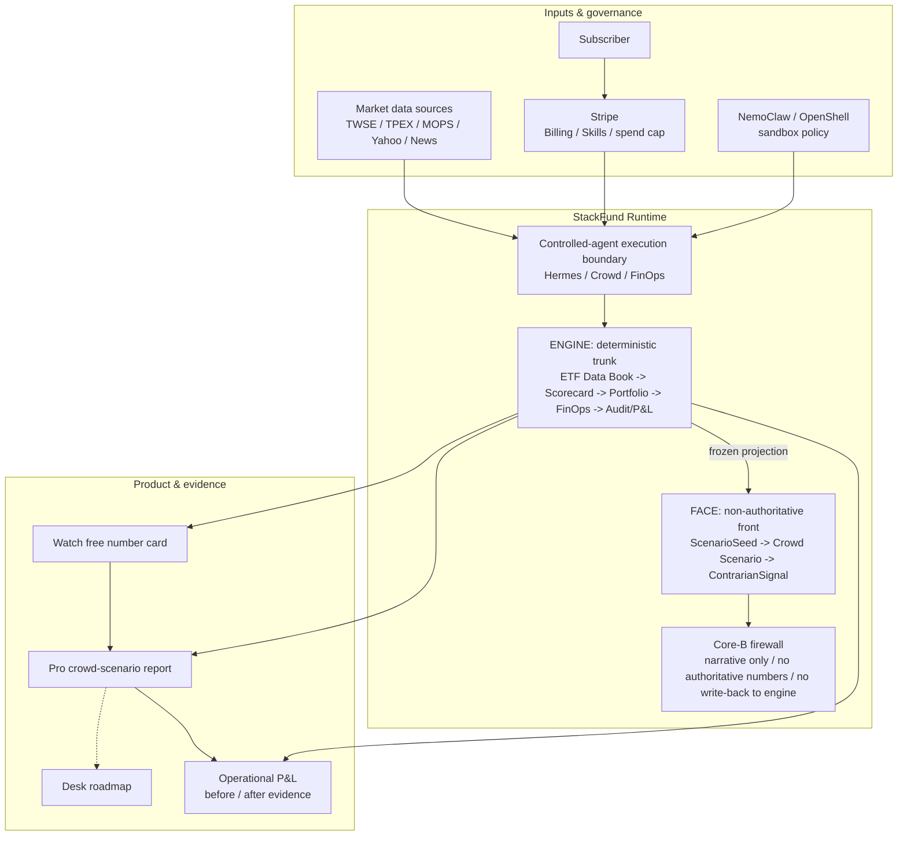
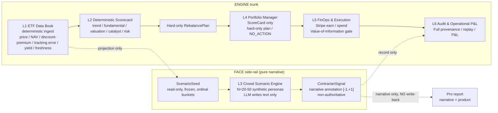
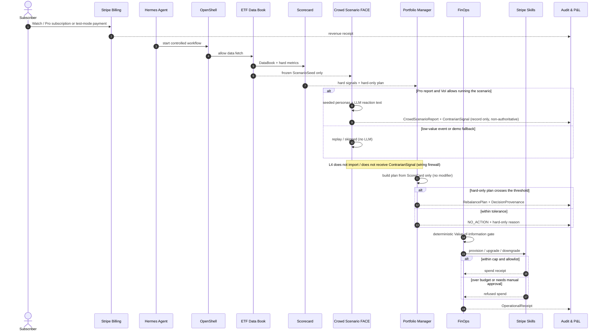
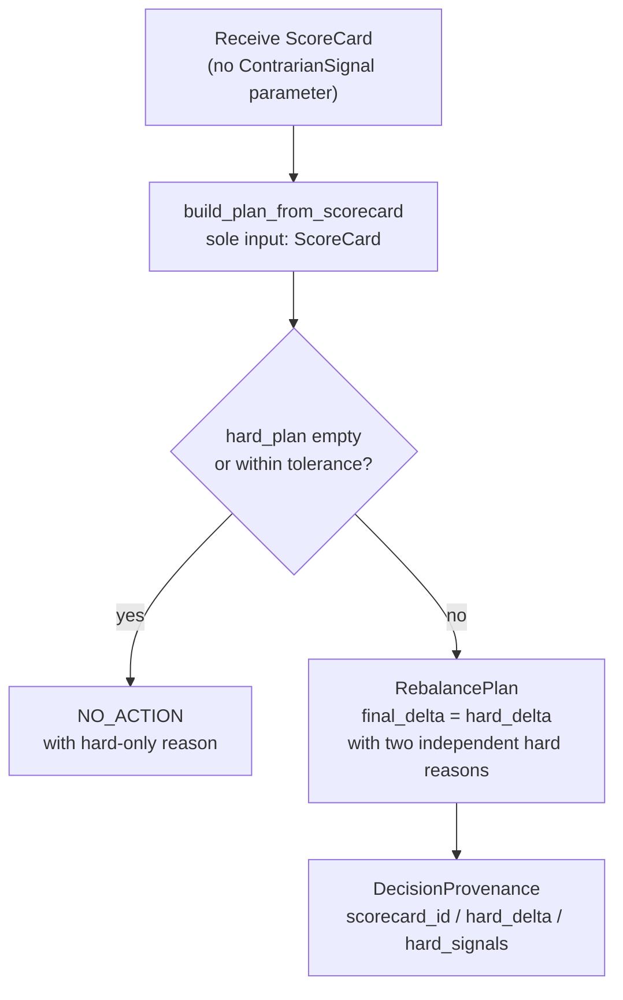
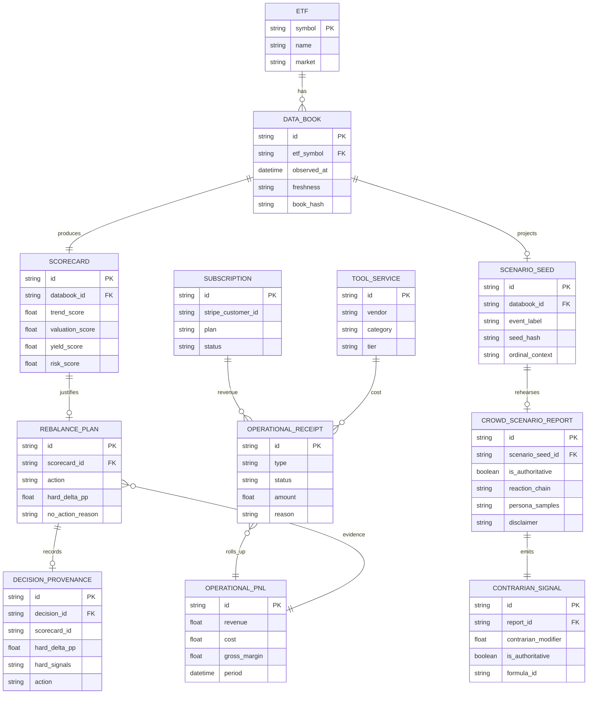
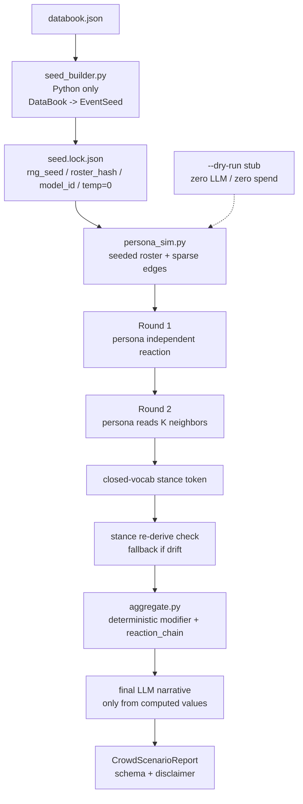
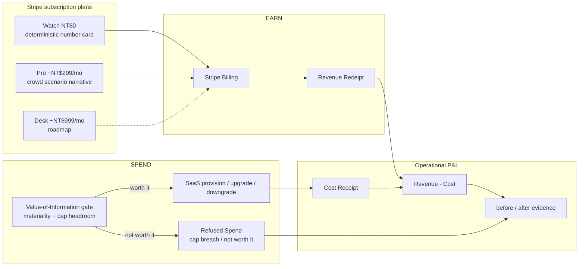
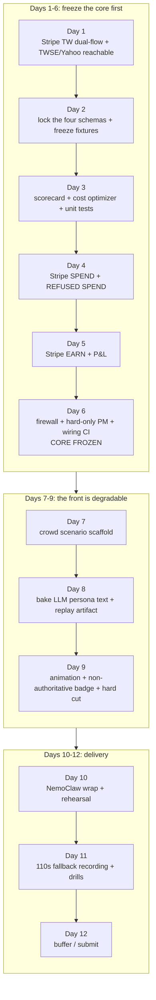
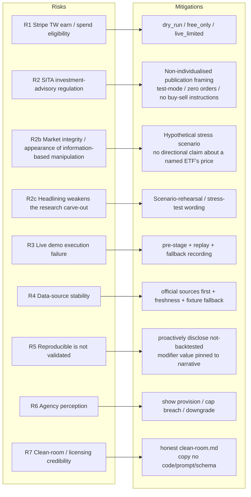

# StackFund Architecture Analysis (Mermaid, Core-B layout-optimised edition)

> Source document: `doc/StackFund_Feasibility_Report.md` · 中文版 / Chinese: [StackFund_架構分析_Mermaid.md](StackFund_架構分析_Mermaid.md)
>
> This document is aligned with feasibility report v3.1, "Core-B finalised architecture (FACE as a pure-narrative side-rail)". This update realises the v3.1 architecture change: FACE becomes a pure-narrative side-rail, the crowd layer never writes back to L4 — the two-key gate / bounded clamp / threshold-flip / TiltProvenance / zero-modifier CI are removed and replaced by an "L4 is not wired" structural firewall.

## 0. Authoring assumptions and acceptance criteria

### Authoring assumptions

- StackFund's core is an autonomously-run Taiwan-ETF research micro-business; the product front-of-house is the "crowd-scenario rehearsal engine".
- Stripe handles only the business cash flow: subscriptions, operating spend, SaaS provisioning, spend refusal; it never places securities orders.
- Core-B's central contract is the FACE / ENGINE separation: the crowd-scenario engine is FACE; the deterministic Python trunk is ENGINE.
- The crowd-scenario engine emits only narrative, persona samples, a reaction chain and one non-authoritative `contrarian_modifier`; it must not decide authoritative numbers like price / NAV / yield / weight / spend-cap, and never writes back to any decision layer.
- The RebalancePlan is decided by the ScoreCard alone; the crowd modifier never enters the decision path, so every non-zero action is, by construction, independently justified by hard data.

### Acceptance criteria

- You can see v3 upgrade from the old five-layer architecture to the Core-B six-layer architecture.
- You can see that the L3 crowd-scenario engine is a pure-narrative side-rail leaf node that does not write back to L1 / L2 / L4 / L5 (zero wiring to the decision path).
- You can see that the Portfolio Manager consumes only the ScoreCard's output (hard-only plan / NO_ACTION) and never consumes the modifier.
- The Mermaid diagrams are layout-optimised only, keeping the original style — no colours or themes added.

---

## 1. Reading of the updated feasibility report's architecture

| Analysis dimension | v3 reading | Architecture impact |
|---|---|---|
| Product front | The Pro plan sells a second-order reaction-chain narrative, not stronger numbers | Adds the Crowd Scenario FACE |
| Trunk credibility | All market numbers, weights and spend are computed by deterministic Python | L1 / L2 / L4 / L5 stay authoritative |
| Firewall | L3 only emits typed objects, imports no compute or Stripe modules, and is not wired to the decision path | Needs five layers of control: type, import, input, flag, **wiring** |
| How the PM consumes | **L4 consumes no modifier at all — only the ScoreCard** | L4 does not import / does not receive ContrarianSignal (wiring CI) |
| Regulatory risk | The firewall is a correctness control, not the primary advisory defence | The compliance line is still: non-individualised, test-mode, zero orders, disclaimer |
| Demo strategy | The crowd engine takes the WOW beat, but earn / spend / refused-spend stay the spine | The runbook marks live / replayed; live re-bake is forbidden |

---

## 2. System overview: FACE catches the eye, ENGINE steers

This diagram keeps only the high-level system boundaries; detailed object relationships are left to the later diagrams, so the overview doesn't become a circuit diagram.

### Architecture highlights

- `Watch` sells deterministic facts; `Pro` sells the crowd-scenario narrative plus the underlying research conclusion.
- The crowd-scenario engine is a pure-narrative leaf node: it reads `ScenarioSeed` and emits a `ContrarianSignal` that flows only to the Pro report and the audit — it cannot write back to L1 / L2 / L4 / L5.
- L4 is the steering wheel: it consumes only the ScoreCard to produce a hard-only plan or NO_ACTION, and accepts no tilt.

---

## 3. The Core-B six-layer architecture

### Six-layer responsibilities

| Layer | Authority | Responsibility | Must not |
|---|---|---|---|
| L1 ETF Data Book | Authoritative | Fetch, normalise, mark freshness, produce DataBook / ScenarioSeed | Draw investment conclusions |
| L2 Deterministic Scorecard | Authoritative | Produce the scorecard and hard signals via transparent formulas | Let the LLM do mental arithmetic |
| L3 Crowd Scenario Engine | Non-authoritative | Produce the second-order reaction-chain narrative, persona samples, and a non-authoritative modifier annotation | Decide price, weight, spend or orders, or write back to any decision layer |
| L4 Portfolio Manager | Authoritative | Consume only the ScoreCard to produce a hard-only plan, NO_ACTION, decision provenance | Import or receive ContrarianSignal |
| L5 FinOps & Execution | Authoritative | Stripe earn/spend, refused spend, VoI gate | Be primarily triggered by a crowd signal |
| L6 Audit & Operational P&L | Authoritative | Provenance, replay, Operational P&L, disclaimer | Store sensitive tokens |

---

## 4. Main operational flow

---

## 5. The crowd-scenario firewall

```mermaid
flowchart LR
    Seed["ScenarioSeed<br/>frozen ordinal context<br/>no raw price setters"]

    subgraph InputChecks["Input / import checks"]
        direction TB
        InputGuard["Input guard<br/>ScenarioSeed read-only"]
        ImportGuard["Import guard<br/>no L1/L2/L4/L5 compute imports"]
    end

    subgraph CrowdLayer["L3 Crowd Scenario Engine"]
        direction LR
        Personas["Synthetic personas<br/>N=20-50"]
        Reaction["LLM reaction text<br/>stance token only"]
        Aggregate["Deterministic aggregate<br/>closed-vocab stance"]
        Personas --> Reaction --> Aggregate
    end

    subgraph OutputChecks["Output checks"]
        direction TB
        TypeGuard["Type guard<br/>no price / NAV / yield / weight / cap fields"]
        FlagGuard["Flag guard<br/>assert is_authoritative=false"]
        WireGuard["Wiring guard<br/>L4 import graph has no L3/Signal"]
        Signal["ContrarianSignal<br/>modifier in [-1,+1]<br/>is_authoritative=false"]
        TypeGuard --> FlagGuard --> WireGuard --> Signal
    end

    ProReport["Pro report<br/>narrative = product"]
    L4Decision["L4 decision path<br/>ScoreCard only (no Signal)"]
    Audit["L6 Audit<br/>record only"]
    Reject["Schema violation<br/>abort / strip / fail closed"]

    Seed --> InputGuard --> Personas
    ImportGuard -.-> Personas
    Aggregate --> TypeGuard
    TypeGuard -->|"forbidden numeric/action field"| Reject
    FlagGuard -->|"flag not false"| Reject
    Signal -.->|"narrative only, NO write-back"| ProReport
    Signal -->|"record only"| Audit
    WireGuard --x L4Decision
```

### Firewall invariants

| Invariant | How it is checked |
|---|---|
| L3 emits no authoritative market or action fields | `CrowdScenarioReport` / `ContrarianSignal` schema, fail-closed |
| L3 imports no compute, Portfolio or Stripe modules | `test_firewall_no_imports` / import-graph grep |
| L3 reads only the frozen `ScenarioSeed` | No setters; inputs are already bucketed |
| `is_authoritative` is always false | Schema const + runtime assert |
| Persona text must not carry into a numeric decision | Forbidden-output scan / numeric-token strip |
| The L4 decision path does not receive `ContrarianSignal` | L4 import-graph grep; `build_rebalance_plan` signature takes only `ScoreCard` |

---

## 6. Portfolio Manager decision rule (pure hard data, no modifier consumption)

### PM design reading

- The crowd modifier never enters L4; the RebalancePlan is decided by the ScoreCard alone and is independently justifiable by construction.
- L4 simply never receives the modifier, so there is no possibility of "L3 quietly becoming the deciding factor"; both NO_ACTION and actions are pure hard data.
- The wiring CI is the machine-checkable core: it asserts that the L4 import graph contains no L3 / ContrarianSignal, and that the `build_rebalance_plan` signature takes only the ScoreCard.

---

## 7. Data contracts and core objects

The v3 schema set grows from three to four: `ETFResearchReport`, `RebalancePlan`, `OperationalReceipt`, `CrowdScenarioReport`. It also adds `ScenarioSeed`, `ContrarianSignal`, `DecisionProvenance` as the key objects for the firewall and auditability. **The crowd-layer output (`ContrarianSignal`) is wired only to the report and the audit, never to the `RebalancePlan`.**

### Schema-first update points

- `CrowdScenarioReport`'s root-level `is_authoritative` must be `false`, with `additionalProperties:false`.
- `ContrarianSignal`'s `contrarian_modifier ∈ [-1,+1]` is a **non-authoritative report annotation**; it enters no decision path.
- `RebalancePlan` is produced by the ScoreCard alone, preserving hard-only reasons and the `NO_ACTION` reason (no tilt provenance).
- `OperationalReceipt` must be able to represent `spend`, `earn`, `refused_spend`, `blocked`, `manual_review`.
- No schema may store sensitive tokens, plaintext keys or payment credentials.

---

## 8. Crowd Scenario skill pipeline

### Clean-room and value reading

| Reading | Architecture handling |
|---|---|
| Do not integrate MiroFish directly | AGPL, a long-running service, OASIS/Zep, high LLM cost — all unsuitable for an MVP |
| Use clean-room distillation | Take only the "heterogeneous personas form a second-order chain" idea; copy no code / prompt / schema |
| The modifier claims no greater accuracy | The value is pinned to the reaction_chain narrative, not to a scalar |
| Reproducible ≠ validated | `seed.lock.json` makes the replay reproducible, but the demo must state it is not backtested |
| The front is degradable | If behind schedule by 6/29, cut the replay animation for a static card; the core is untouched |

---

## 9. FinOps, subscriptions and a single P&L

### The FinOps firewall

- `contrarian_modifier` plays no part whatsoever in a spend decision (not even as a tie-breaker); spend is gated purely by the deterministic VoI gate.
- Whether a paid report is worth running is judged by the deterministic VoI gate.
- Refused spend is a core demo beat: the agent doesn't just spend money — it can also refuse to spend when it isn't worth it.

---

## 10. Demo and build roadmap

### The 110-second demo rhythm

| Segment | Purpose | Architecture signal |
|---|---|---|
| 0:00-0:10 | Firewall cold open | The crowd engine is non-authoritative, touches no amount/weight/order |
| 0:10-0:24 | EARN live | Stripe Billing revenue flows into the P&L |
| 0:24-0:38 | SPEND pre-staged | The agent provisions a tool; the cost flows into the P&L |
| 0:38-0:50 | REFUSED SPEND live error path | Stripe cap hard-refuses; the agent does NO_ACTION |
| 0:50-0:78 | Scenario engine WOW replay | `is_authoritative=false`; auditable but not validated |
| 0:78-0:96 | Hard cut back to the engine | Show the import graph: L4 never received the crowd layer (it was never wired in) |
| 0:96-0:110 | Viability close | Before/after P&L and the disclaimer |

---

## 11. Risk-mapping diagram

### Updated risk reading

| Risk | Updated architecture response |
|---|---|
| Firewall write-back risk | FACE is a pure-narrative side-rail; the modifier never enters L4; wiring CI (L4 import graph has no L3 / Signal) |
| Modifier influencing spend | Spend is gated purely by the VoI gate; the modifier plays no part (not even as a tie-breaker) |
| The three demo Stripe calls failing | live/replayed marking, pre-staged spend, fallback recording |
| Headline narrative misread as a forecast | Use "scenario rehearsal / stress test"; forbid "forecast / prediction" |
| Regulatory exposure | The primary defence is non-individualised, test-mode, zero orders, disclaimer — not the firewall |
| Clean-room credibility | Honestly acknowledge having understood the source, but copied no code / prompt / schema |

---

## 12. Summary of key design decisions

| Decision | Why it matters |
|---|---|
| Promote the crowd engine to the product front, but keep it non-authoritative | Adds differentiation while avoiding polluting the core decision |
| The Core-B six-layer architecture | Makes the FACE / ENGINE boundary explicit |
| `ContrarianSignal` typed output | Lets L3 emit only a bounded, auditable, non-authoritative object, wired only to the report and audit — never into L4 |
| Hard-only only | L4 consumes only the ScoreCard; the crowd narrative never enters a decision |
| The wiring firewall | L4 does not import / does not receive ContrarianSignal — structurally zero-wired |
| The wiring CI | Turns "L4 never wired in the crowd layer" into a testable invariant (import graph) |
| The VoI gate controlling paid reports | Keeps the spend decision governed by hard data and budget |

---

## 13. Document conclusion

The updated StackFund architecture is no longer just "a Taiwan-ETF research desk + Stripe cash flow". v3 makes the product front-of-house a "crowd-scenario rehearsal engine", but the most important architectural value is that it is strictly isolated: the crowd layer owns the demonstrable, sellable, replayable second-order narrative; the deterministic trunk owns all numbers, weights, spend and P&L.

Core-B holds on three checkable commitments:

- The crowd layer emits only a `ContrarianSignal`, with `is_authoritative=false`.
- Every RebalancePlan in L4 is decided by the ScoreCard alone; the crowd layer never enters the decision path (provable by the wiring CI).
- L5's spend is governed by the deterministic VoI gate and a hard Stripe cap; the crowd layer cannot primarily trigger a spend.

So the conclusion of this architecture analysis is: v3 is more presentation-advantaged than the old version, but also more dependent on the firewall, the wording, demo discipline and proactive disclosure. As long as the Core is frozen before Day 6 (firewall, hard-only PM, P&L, wiring CI), even if the scenario animation is cut at the end, StackFund still retains the core persuasiveness of earn / spend / run real operations.
