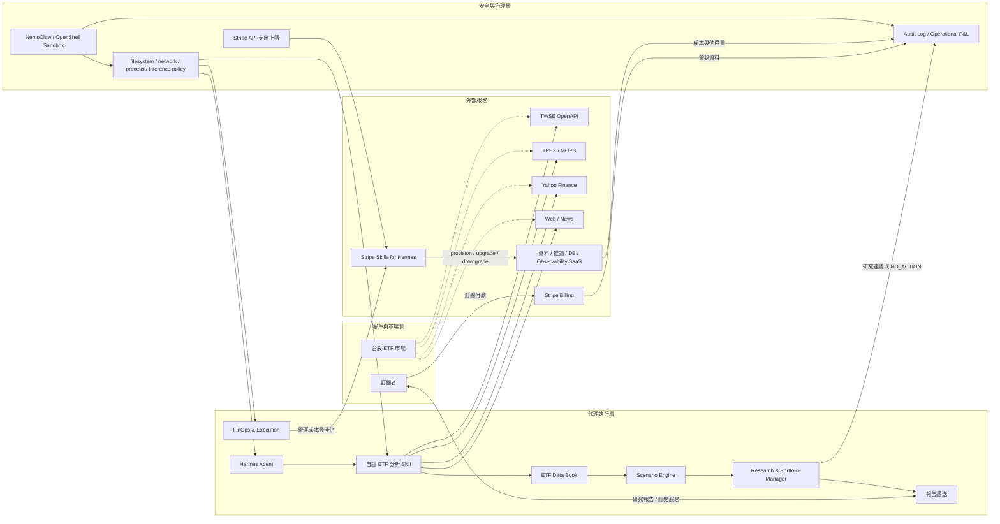
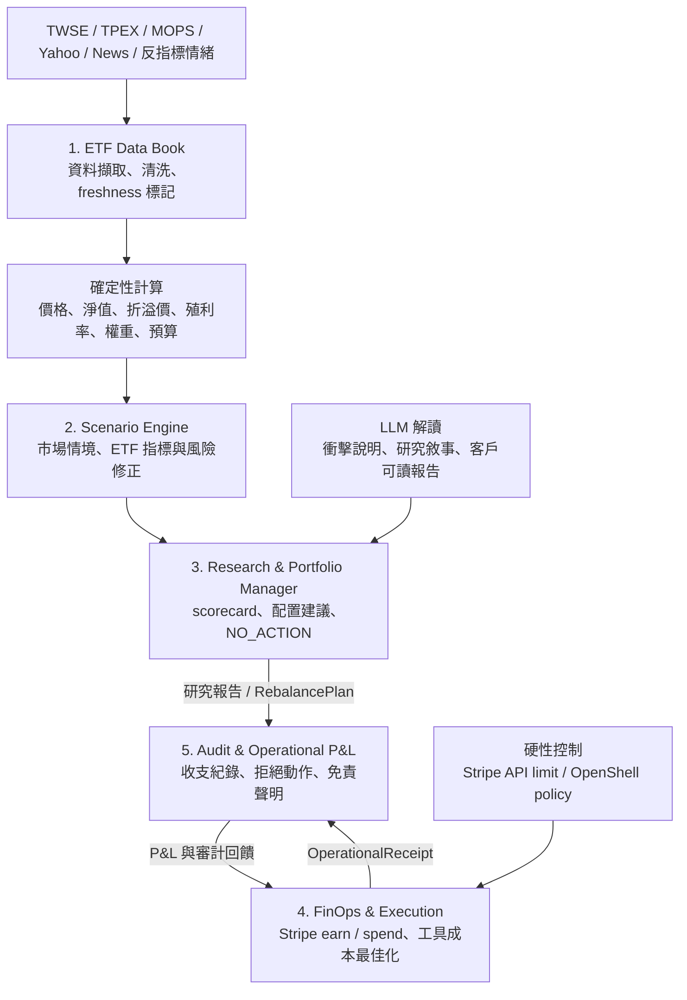
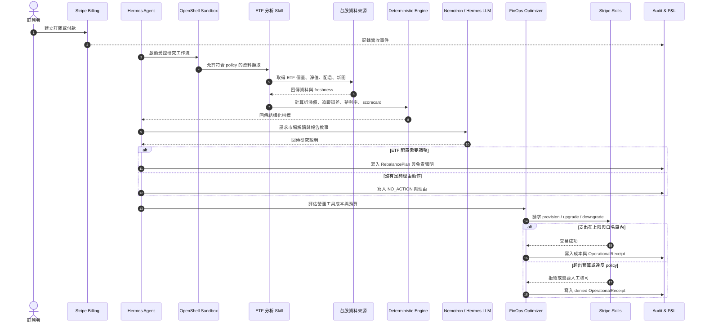
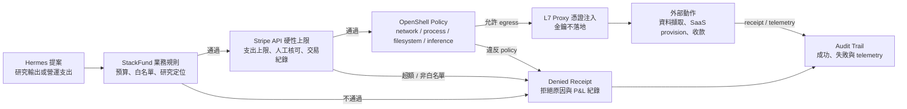
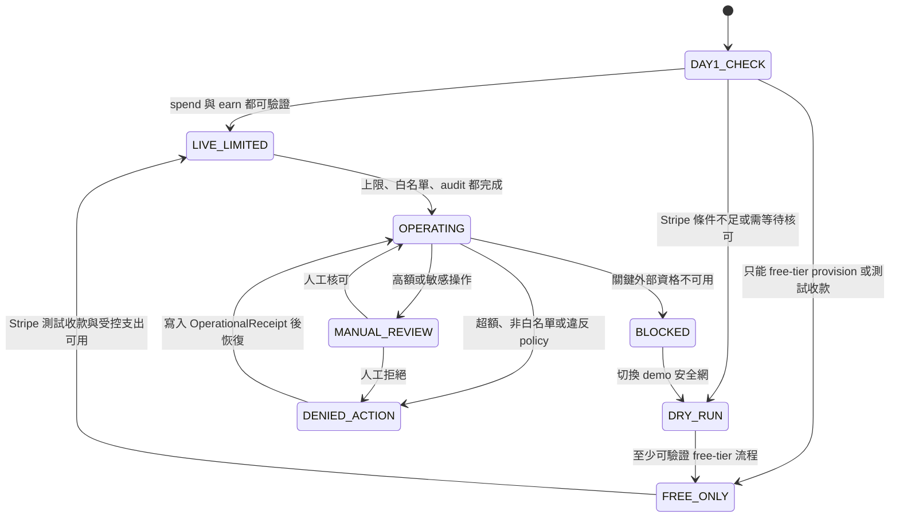
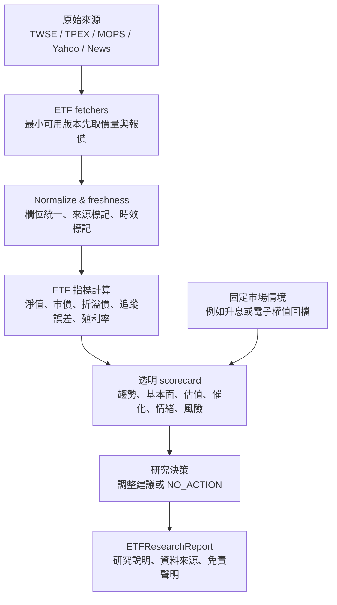
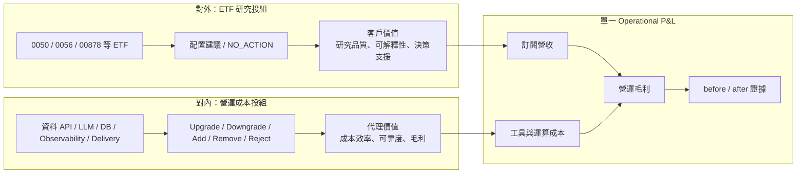
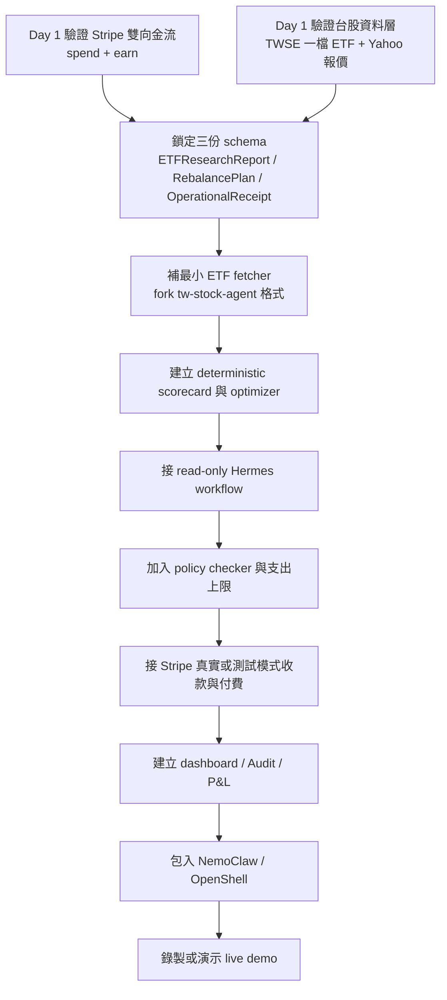
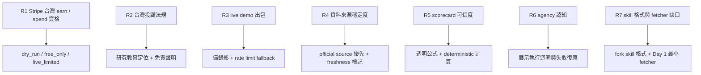

# StackFund 架構分析（Mermaid）

> 來源文件：`doc/StackFund_可行性報告.md`
>
> 本文件是架構整理稿，不覆蓋原可行性報告。內容僅根據來源文件抽象化，不額外查證外部平台最新狀態。

## 0. 撰寫假設與驗收標準

### 撰寫假設

- StackFund 的產品定位是「台股 ETF 研究／教育決策支援」，不是受託操作，也不是收費證券投資顧問。
- Stripe 在此架構中負責事業金流：訂閱收款、營運支出、SaaS provision，不負責證券下單。
- Hermes 負責代理編排與跨 session 工作流；NVIDIA NemoClaw／OpenShell 負責執行邊界與安全控管。
- 台股 ETF 研究資料由自訂 Hermes Skill 取得，設計參考 `AZNitro/tw-stock-agent` 的 skill 形式。
- 計算類任務由 deterministic Python 或等價的確定性程式處理；LLM 只負責解讀、說明與報告撰寫。

### 驗收標準

- 能看出 StackFund 的主要元件、外部依賴、信任邊界與資料流。
- 每張圖只描述一個架構視角，避免單圖過大。
- Mermaid 使用常見圖型：`flowchart`、`sequenceDiagram`、`erDiagram`、`stateDiagram-v2`。
- 文件不新增原報告沒有要求的功能，只把既有設計轉成可維護的架構圖與說明。

---

## 1. 架構總覽

StackFund 是一個由代理經營的台股 ETF 研究事業。它同時處理三條主線：

- 對客戶：產出台股 ETF 研究報告、配置建議與 NO_ACTION 判斷。
- 對自己：管理資料、推論、資料庫、observability、報告遞送等營運成本。
- 對平台：透過 Hermes、Stripe、OpenShell 把 agentic workflow、金流與安全邊界組合成真實營運 demo。

---

## 2. 五層主架構

來源文件把系統整理成五層：ETF Data Book、Scenario Engine、Research & Portfolio Manager、FinOps & Execution、Audit & Operational P&L。這個分層的重點是把「研究產出」與「事業營運」放在同一個代理工作流內，但維持明確職責邊界。

### 分層責任

| 層級 | 主要責任 | 不應負責 |
|---|---|---|
| ETF Data Book | 擷取資料、標記時效、保留來源 | 做投資結論 |
| Scenario Engine | 建立市場情境與 ETF 指標 | 自行編造缺失資料 |
| Research & Portfolio Manager | 產出 scorecard、研究結論、NO_ACTION | 真實證券下單 |
| FinOps & Execution | 管理 earn/spend、工具升降級與支出拒絕 | 繞過 Stripe 限額 |
| Audit & Operational P&L | 記錄報告、收支、拒絕原因與免責聲明 | 儲存敏感 token 或明文金鑰 |

---

## 3. 主要執行流程

這個流程展示一次完整營運循環：客戶訂閱、代理抓資料、計算 ETF 指標、產出研究、執行或拒絕營運支出，最後寫入 P&L。

---

## 4. 資料契約與核心物件

來源文件建議先鎖三份 schema：`ETFResearchReport`、`RebalancePlan`、`OperationalReceipt`。下圖把它們與 ETF、資料快照、訂閱、工具服務的關係拆開，方便後續實作時對齊 JSON schema。

```mermaid
erDiagram
    ETF ||--o{ DATA_SNAPSHOT : has
    ETF ||--o{ ETF_RESEARCH_REPORT : summarized_by
    DATA_SNAPSHOT ||--|| SCORECARD : produces
    SCORECARD ||--o| REBALANCE_PLAN : may_create
    ETF_RESEARCH_REPORT ||--o| REBALANCE_PLAN : includes
    SUBSCRIPTION ||--o{ OPERATIONAL_RECEIPT : creates_revenue
    TOOL_SERVICE ||--o{ OPERATIONAL_RECEIPT : creates_cost
    OPERATIONAL_RECEIPT }o--|| OPERATIONAL_PNL : rolls_up_to

    ETF {
        string symbol PK
        string name
        string market
        string category
    }

    DATA_SNAPSHOT {
        string id PK
        string etf_symbol FK
        datetime observed_at
        string source
        string freshness
    }

    SCORECARD {
        string id PK
        string snapshot_id FK
        float premium_discount
        float tracking_error
        float dividend_yield
        float risk_score
        float total_score
    }

    ETF_RESEARCH_REPORT {
        string id PK
        string etf_symbol FK
        string scenario
        string thesis
        string disclaimer
        datetime created_at
    }

    REBALANCE_PLAN {
        string id PK
        string report_id FK
        string action
        float target_weight
        string rationale
        string no_action_reason
    }

    SUBSCRIPTION {
        string id PK
        string stripe_customer_id
        string plan
        string status
    }

    TOOL_SERVICE {
        string id PK
        string vendor
        string category
        string tier
    }

    OPERATIONAL_RECEIPT {
        string id PK
        string type
        string status
        float amount
        string reason
        datetime created_at
    }

    OPERATIONAL_PNL {
        string id PK
        float revenue
        float cost
        float gross_margin
        datetime period
    }
```

### Schema-first 注意事項

- `ETFResearchReport` 必須包含資料來源、freshness、免責聲明與研究定位。
- `RebalancePlan` 必須允許 `NO_ACTION`，且要保存理由。
- `OperationalReceipt` 必須能表示成功、拒絕、blocked、manual_review 等狀態。
- 敏感 token、明文金鑰與 payment credential 不得進入任何報告或 JSON schema。

---

## 5. 信任邊界與風控

文件中的關鍵判斷是：真正的硬保證不在 prompt，也不在代理自律，而在 Stripe API 層限制與 OpenShell policy。業務規則可以提醒代理，但不能當成唯一安全邊界。

### 控制層級

| 控制 | 類型 | 架構角色 |
|---|---|---|
| StackFund 業務規則 | 軟控制 | 提醒與約束代理決策 |
| deterministic 計算 | 正確性控制 | 避免 LLM 心算數字或幻想數據 |
| Stripe API 支出上限 | 硬控制 | 防止代理超額消費 |
| OpenShell policy | 硬控制 | 限制網路、process、filesystem、inference |
| Audit & P&L | 可追溯控制 | 保存成功、失敗、拒絕與營收成本證據 |

---

## 6. FinOps 狀態機

來源文件要求 Day 1 驗證 Stripe 雙向金流，並保留 `dry_run`、`free_only`、`live_limited` 等退路。以下狀態機描述 demo 與營運模式的切換。

### 模式說明

| 模式 | 用途 | 成功條件 |
|---|---|---|
| `dry_run` | 無真實付款，驗證流程與 receipt | 能完整產出預期動作與拒絕原因 |
| `free_only` | 只使用 free-tier provision 或測試收款 | 能展示 earn/spend 的結構，但不承諾真實付費 |
| `live_limited` | 有真實或測試模式金流，且嚴格限額 | 能展示至少一筆受控 spend 與一筆 earn |
| `operating` | MVP 完整模式 | policy、支出上限、audit、免責聲明全部落地 |

---

## 7. ETF 研究資料流

這張圖只看研究資料如何變成報告。核心原則是「資料與數值先確定，LLM 後解讀」。

### ETF 特有欄位

| 欄位 | 架構意義 | 計算責任 |
|---|---|---|
| 淨值 vs 市價 | 判斷折溢價 | deterministic |
| 追蹤誤差 | 判斷 ETF 是否偏離標的 | deterministic |
| 成分股重疊 | 判斷配置集中度 | deterministic |
| 除息／配息日 | 判斷收益與事件風險 | deterministic |
| 新聞與情緒 | 輔助市場解讀 | LLM 可解讀，但不得凌駕硬數據 |

---

## 8. 雙投組與單一 P&L

StackFund 的設計亮點是有兩個投組，但最後統一回到一張 Operational P&L。

### 架構含意

- 對外投組回答「客戶該如何理解 ETF 配置」。
- 對內投組回答「代理該如何花自己的營運預算」。
- P&L 把客戶價值與營運成本放在同一張表，讓 demo 不只是研究工具，也是一個能自我經營的微型事業。

---

## 9. MVP 開發順序

這不是新增功能，而是把來源文件中的建議開發順序轉成架構落地路線。重點是先打通真實執行，再包安全沙盒。

### Go / No-Go 檢查

| 檢查點 | Go 條件 | No-Go 或退路 |
|---|---|---|
| Stripe spend | 至少一個受控 provision 可執行 | 改為 `free_only` 或 `dry_run` |
| Stripe earn | 測試卡或真實模式訂閱流程可展示 | 改為測試模式收款 |
| 台股資料 | TWSE + Yahoo 最小資料可取得 | 使用 fixture 並明確標 freshness |
| 法規定位 | 報告全程保持研究／教育語氣 | 不展示個別化買賣指令 |
| Demo 可靠性 | live path 與備錄影都完成 | 以錄影 fallback，標明真實限制 |

---

## 10. 風險對應圖

來源文件的 R1 到 R7 可歸納成四類：平台資格、法規、資料與 demo 可靠性、代理可信度。

### 風險整理

| 風險 | 架構回應 |
|---|---|
| Stripe 資格不確定 | 用模式切換，不把 demo 綁死在完整 live 金流 |
| 投顧法規 | 全部輸出定位為研究／教育決策支援 |
| 資料不穩 | 官方來源優先、Yahoo 輔助、fixture fallback、freshness 標記 |
| scorecard 被質疑 | 公式透明，讓可觀測訊號推導分數 |
| agency 被質疑 | 展示 Hermes 處理真實 provision、拒絕、downgrade 與 receipt |
| 安全性被質疑 | 用 Stripe API limit 與 OpenShell policy 作硬邊界 |

---

## 11. 關鍵設計決策摘要

| 決策 | 為什麼重要 |
|---|---|
| Stripe 只處理事業金流，不碰證券交易 | 避開「用 Stripe 買 ETF」的錯誤邊界，也降低法規風險 |
| deterministic 與 LLM 分工 | 數值可信度靠確定性計算，LLM 負責可讀解釋 |
| schema-first | 先鎖輸出契約，避免報告、receipt、P&L 各做各的 |
| NO_ACTION 是一等結果 | 代理能拒絕不必要動作，才像真正推理而不是看到就執行 |
| 雙投組、單一 P&L | 同時展示客戶價值與代理事業是否賺錢 |
| OpenShell + Stripe 雙硬邊界 | 即使代理判斷錯誤，也有 API 與 sandbox 層防護 |
| Day 1 驗證外部依賴 | 把最大不確定性前移，避免最後才發現 demo 跑不起來 |

---

## 12. 文件結論

StackFund 的架構可被清楚拆成「代理編排」、「ETF 研究」、「FinOps 金流」、「安全邊界」、「審計與 P&L」五個核心面向。來源文件最強的設計不是單純產出 ETF 建議，而是讓代理真正經營一個微型研究事業：抓真實資料、產出研究、向訂閱者收費、管理自己的營運成本，並在不值得或不允許時拒絕行動。

以 Mermaid 圖來看，這套架構的成功關鍵是三個邊界：

- 研究邊界：只做研究與教育決策支援，不做下單或個別化收費投顧。
- 計算邊界：硬數字由 deterministic engine 算，LLM 不負責心算。
- 執行邊界：外部花費與網路行為由 Stripe API limit 與 OpenShell policy 控住。

若 Phase 1 能驗證 Stripe 雙向金流與台股資料最小流程，StackFund 就具備繼續落地 MVP 的架構基礎。
