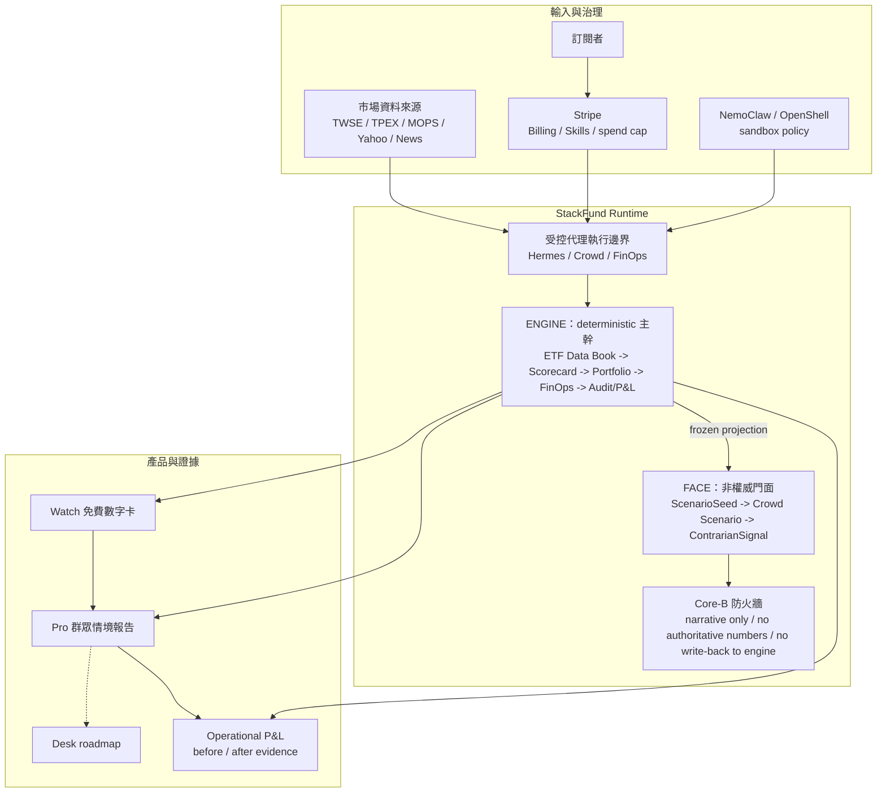
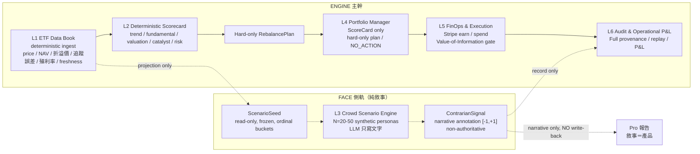
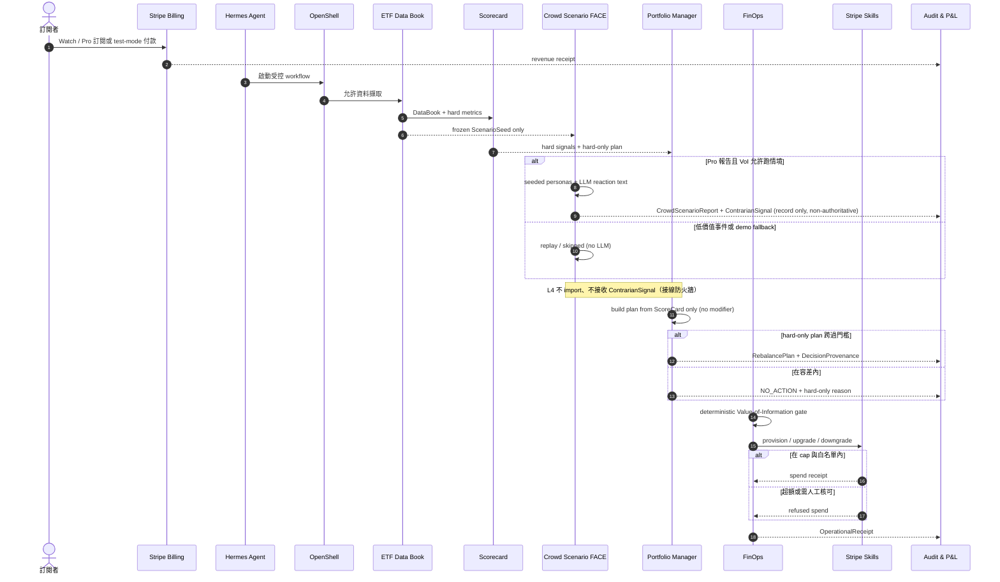
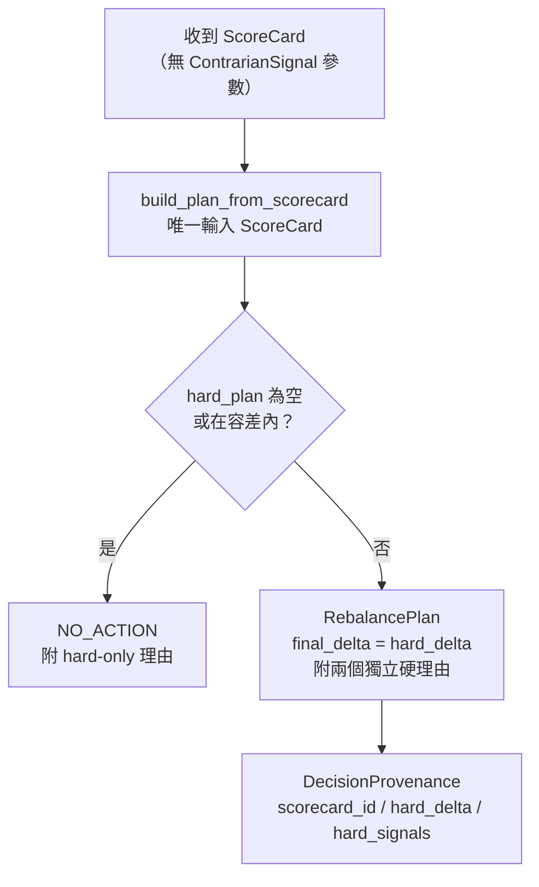
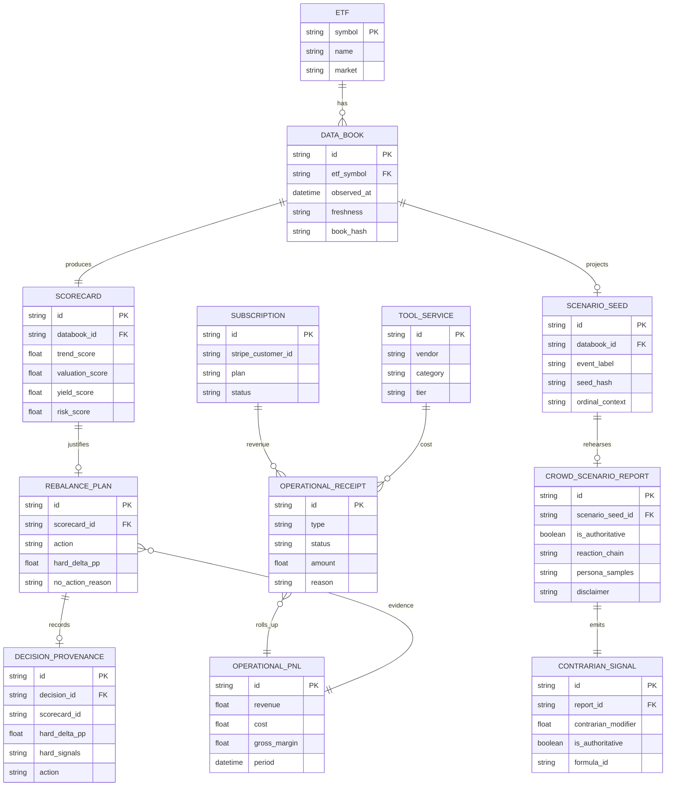
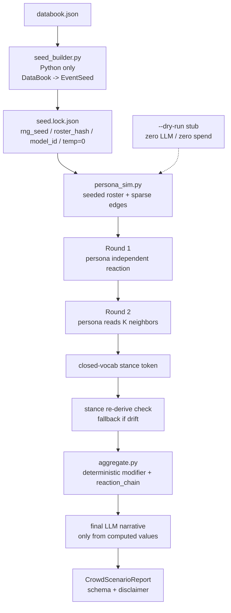
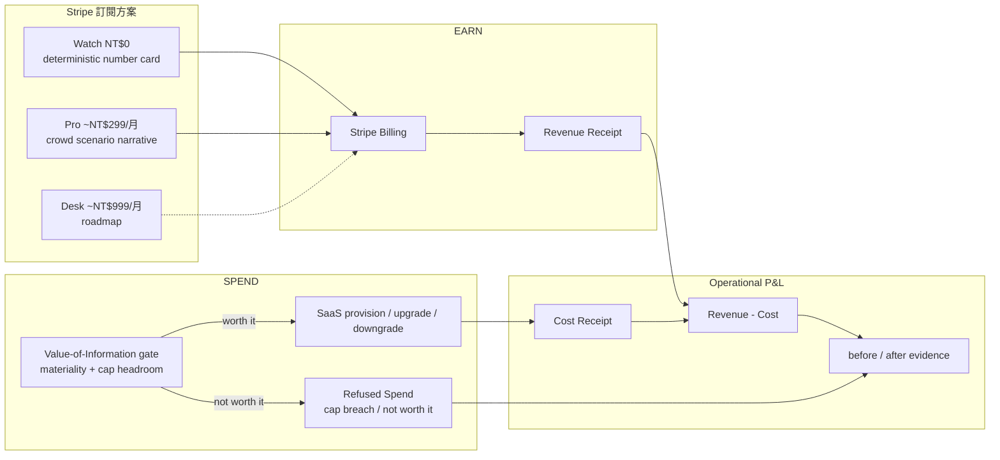
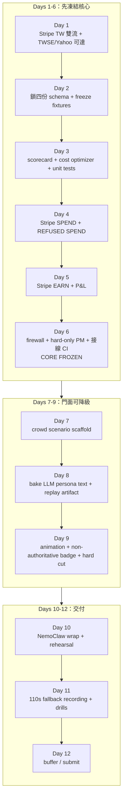
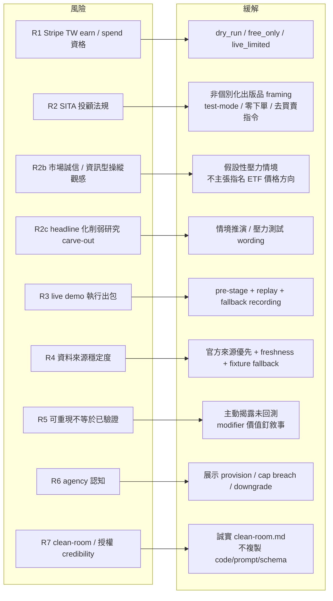

# StackFund 架構分析（Mermaid，Core-B 排版優化版）

> 來源文件：`doc/StackFund_可行性報告.md` · English: [StackFund_Architecture_Mermaid.md](StackFund_Architecture_Mermaid.md)
>
> 本文件對齊可行性報告 v3.1「Core-B 架構定案版（FACE 純敘事側軌）」。本次更新落實 v3.1 架構變更：FACE 改為純敘事側軌，群眾層不回寫 L4——移除 two-key gate／bounded clamp／threshold-flip／TiltProvenance／zero-modifier CI，改以「L4 不接線」結構防火牆取代。

## 0. 撰寫假設與驗收標準

### 撰寫假設

- StackFund 的主體是自主經營的台股 ETF 研究微型事業；產品門面是「群眾情境推演引擎」。
- Stripe 只負責事業金流：訂閱、營運支出、SaaS provision、支出拒絕；不負責證券下單。
- Core-B 的核心契約是 FACE / ENGINE 分離：群眾情境引擎是 FACE，deterministic Python 主幹是 ENGINE。
- 群眾情境引擎只輸出敘事、人格樣本、反應鏈與一個非權威 `contrarian_modifier`；不得決定 price／NAV／yield／weight／spend-cap 等權威數字，也不回寫任何決策層。
- RebalancePlan 由 ScoreCard 單獨決定；群眾 modifier 不進入決策路徑，故每個非零動作按建構即由硬數據獨立辯護。

### 驗收標準

- 能看出 v3 從舊五層架構升級為 Core-B 六層架構。
- 能看出 L3 群眾情境引擎是純敘事側軌葉節點，不回寫 L1／L2／L4／L5（對決策路徑零連線）。
- 能看出 Portfolio Manager 只吃 ScoreCard 產出 hard-only plan／NO_ACTION，完全不消費 modifier。
- Mermaid 圖只做排版優化，保持原版樣式，不加顏色或 theme。

---

## 1. 更新後可行性報告的架構判讀

| 分析面向 | v3 判讀 | 架構影響 |
|---|---|---|
| 產品門面 | Pro 方案賣二階反應鏈敘事，不是更強的數字 | 新增 Crowd Scenario FACE |
| 主幹可信度 | 所有市場數字、權重、支出由 deterministic Python 算 | L1／L2／L4／L5 保持權威 |
| 防火牆 | L3 只 emit typed object，不 import 計算或 Stripe 模組，且不連決策路徑 | 需要 type、import、input、flag、**接線** 五層控制 |
| PM 消費方式 | **L4 完全不消費 modifier，只吃 ScoreCard** | L4 不 import／不接收 ContrarianSignal（接線 CI） |
| 法規風險 | 防火牆是 correctness 控制，不是主要投顧防線 | 合規主線仍是非個別化、test-mode、零下單、免責 |
| Demo 策略 | 群眾引擎拿 WOW beat，但 earn／spend／refused-spend 保持主軸 | runbook 標 live／replayed，禁 live re-bake |

---

## 2. 系統總覽：FACE 搶眼，ENGINE 掌舵

這張圖只保留高階系統邊界，細部物件關係交給後續圖表，避免總覽圖變成電路圖。

### 架構重點

- `Watch` 賣 deterministic 事實；`Pro` 賣群眾情境敘事加底層研究結論。
- 群眾情境引擎是純敘事葉節點：讀 `ScenarioSeed`，輸出 `ContrarianSignal` 只流向 Pro 報告與稽核，不能回寫 L1／L2／L4／L5。
- L4 是方向盤：只吃 ScoreCard 產生 hard-only plan 或 NO_ACTION，不接收任何 tilt。

---

## 3. Core-B 六層架構

### 六層責任

| 層級 | 權威性 | 責任 | 不可做 |
|---|---|---|---|
| L1 ETF Data Book | 權威 | 擷取、正規化、標記 freshness、產生 DataBook / ScenarioSeed | 做投資結論 |
| L2 Deterministic Scorecard | 權威 | 以透明公式產生 scorecard 與 hard signals | 讓 LLM 心算 |
| L3 Crowd Scenario Engine | 非權威 | 產出二階反應鏈敘事、人格樣本、非權威 modifier 標註 | 決定價格、權重、支出、下單，或回寫任何決策層 |
| L4 Portfolio Manager | 權威 | 只吃 ScoreCard 產 hard-only plan、NO_ACTION、decision provenance | import 或接收 ContrarianSignal |
| L5 FinOps & Execution | 權威 | Stripe earn/spend、refused spend、VoI gate | 被 crowd signal 主觸發 |
| L6 Audit & Operational P&L | 權威 | provenance、replay、Operational P&L、免責聲明 | 儲存敏感 token |

---

## 4. 主要營運流程

---

## 5. 群眾情境防火牆

```mermaid
flowchart LR
    Seed["ScenarioSeed<br/>frozen ordinal context<br/>no raw price setters"]

    subgraph InputChecks["輸入 / import 檢查"]
        direction TB
        InputGuard["Input guard<br/>ScenarioSeed read-only"]
        ImportGuard["Import guard<br/>no L1/L2/L4/L5 compute imports"]
    end

    subgraph CrowdLayer["L3 Crowd Scenario Engine"]
        direction LR
        Personas["Synthetic personas<br/>N=20-50"]
        Reaction["LLM reaction text<br/>stance token only"]
        Aggregate["Deterministic aggregate<br/>closed-vocab stance"]
        Personas --> Reaction --> Aggregate
    end

    subgraph OutputChecks["輸出檢查"]
        direction TB
        TypeGuard["Type guard<br/>no price / NAV / yield / weight / cap fields"]
        FlagGuard["Flag guard<br/>assert is_authoritative=false"]
        WireGuard["Wiring guard<br/>L4 import graph 無 L3/Signal"]
        Signal["ContrarianSignal<br/>modifier in [-1,+1]<br/>is_authoritative=false"]
        TypeGuard --> FlagGuard --> WireGuard --> Signal
    end

    ProReport["Pro 報告<br/>敘事＝產品"]
    L4Decision["L4 決策路徑<br/>ScoreCard only（不接 Signal）"]
    Audit["L6 Audit<br/>record only"]
    Reject["Schema violation<br/>abort / strip / fail closed"]

    Seed --> InputGuard --> Personas
    ImportGuard -.-> Personas
    Aggregate --> TypeGuard
    TypeGuard -->|"forbidden numeric/action field"| Reject
    FlagGuard -->|"flag not false"| Reject
    Signal -.->|"narrative only, NO write-back"| ProReport
    Signal -->|"record only"| Audit
    WireGuard --x L4Decision
```

### 防火牆不變式

| 不變式 | 檢查方式 |
|---|---|
| L3 不輸出權威市場或動作欄位 | `CrowdScenarioReport` / `ContrarianSignal` schema fail-closed |
| L3 不 import 計算、Portfolio、Stripe 模組 | `test_firewall_no_imports` / import graph grep |
| L3 只讀 frozen `ScenarioSeed` | 無 setter，輸入已分桶 |
| `is_authoritative` 永遠為 false | schema const + runtime assert |
| 人格文字不得帶入數字決策 | forbidden-output scan / numeric-token strip |
| L4 決策路徑不接收 `ContrarianSignal` | L4 import graph grep；`build_rebalance_plan` 簽章只吃 `ScoreCard` |

---

## 6. Portfolio Manager 決策規則（純硬數據，無 modifier 消費）

### PM 設計解讀

- 群眾 modifier 完全不進入 L4；RebalancePlan 只由 ScoreCard 決定，按建構即可獨立辯護。
- L4 根本不接收 modifier，故不存在「L3 暗中成為決策主因」的可能；NO_ACTION 與動作皆純硬數據。
- 接線 CI 是可機器檢測的核心：斷言 L4 import graph 中無 L3／ContrarianSignal、`build_rebalance_plan` 簽章只吃 ScoreCard。

---

## 7. 資料契約與核心物件

v3 schema 從三份擴成四份：`ETFResearchReport`、`RebalancePlan`、`OperationalReceipt`、`CrowdScenarioReport`。同時新增 `ScenarioSeed`、`ContrarianSignal`、`DecisionProvenance` 作為防火牆與可稽核性的關鍵物件。**群眾層輸出（`ContrarianSignal`）只連報告與稽核，不連 `RebalancePlan`。**

### Schema-first 更新點

- `CrowdScenarioReport` 根層 `is_authoritative` 必須是 `false`，且 `additionalProperties:false`。
- `ContrarianSignal` 的 `contrarian_modifier ∈ [-1,+1]` 是**非權威報告標註**，不進入任何決策路徑。
- `RebalancePlan` 由 ScoreCard 單獨產生，保存 hard-only 理由與 `NO_ACTION` 理由（無 tilt provenance）。
- `OperationalReceipt` 必須能表示 `spend`、`earn`、`refused_spend`、`blocked`、`manual_review`。
- 所有 schema 不得儲存敏感 token、明文金鑰或 payment credential。

---

## 8. Crowd Scenario Skill 管線

### Clean-room 與價值判讀

| 判讀 | 架構處理 |
|---|---|
| 不直接整合 MiroFish | AGPL、常駐服務、OASIS/Zep、高 LLM 成本皆不適合 MVP |
| 採 clean-room 蒸餾 | 只取「異質人格反應形成二階鏈」概念，不複製 code／prompt／schema |
| modifier 不宣稱更準 | 價值釘在 reaction_chain 敘事，不釘在純量 |
| 可重現不等於已驗證 | `seed.lock.json` 讓 replay 可重現，但 demo 必須說明未經回測 |
| 門面可降級 | 6/29 落後時砍 replay animation，改 static card，核心不動 |

---

## 9. FinOps、訂閱與單一 P&L

### FinOps 防火牆

- `contrarian_modifier` 完全不參與支出決策（連 tie-breaker 都不是）；spend 純由 deterministic VoI gate 把關。
- 付費報告是否值得跑，由 deterministic VoI gate 判斷。
- Refused spend 是 demo 的核心 beat：代理不只會花錢，也能在不值得時拒絕花錢。

---

## 10. Demo 與建置路線

### 110 秒 demo 節奏

| 時段 | 作用 | 架構訊號 |
|---|---|---|
| 0:00-0:10 | 防火牆開場 | 群眾引擎非權威、不碰金額/權重/下單 |
| 0:10-0:24 | EARN live | Stripe Billing 收款進 P&L |
| 0:24-0:38 | SPEND pre-staged | agent provision 工具，成本進 P&L |
| 0:38-0:50 | REFUSED SPEND live error path | Stripe cap 硬拒，代理 NO_ACTION |
| 0:50-0:78 | 情境引擎 WOW replay | `is_authoritative=false`，可稽核但未驗證 |
| 0:78-0:96 | Hard cut 回引擎 | 秀 import graph：L4 從未接收群眾層（根本沒接進來） |
| 0:96-0:110 | viability close | before/after P&L 與免責聲明 |

---

## 11. 風險對應圖

### 風險判讀更新

| 風險 | 更新後架構回應 |
|---|---|
| 防火牆回寫風險 | FACE 純敘事側軌，modifier 不進 L4；接線 CI（L4 import graph 無 L3／Signal） |
| modifier 影響支出 | spend 純由 VoI gate；modifier 不參與（連 tie-breaker 都不是） |
| demo 三筆 Stripe 失敗 | live/replayed 標示、pre-staged spend、fallback recording |
| headline 敘事被誤讀成預測 | 用「情境推演／壓力測試」，禁「預測／預報」 |
| 法規曝險 | 主要防線是非個別化、test-mode、零下單、免責，不是防火牆 |
| clean-room credibility | 誠實承認曾理解 source，但未複製 code／prompt／schema |

---

## 12. 關鍵設計決策摘要

| 決策 | 為什麼重要 |
|---|---|
| 群眾引擎升為產品門面，但非權威 | 增加差異化，同時避免污染核心決策 |
| Core-B 六層架構 | 把 FACE 與 ENGINE 的邊界顯性化 |
| `ContrarianSignal` typed output | 讓 L3 只能輸出有界、可稽核、非權威物件，且只連報告與稽核、不進 L4 |
| hard-only only | L4 只吃 ScoreCard，群眾敘事永不進決策 |
| 接線防火牆 | L4 不 import／不接收 ContrarianSignal，結構上零連線 |
| 接線 CI | 把「L4 根本沒接群眾層」變成可測不變式（import graph） |
| VoI gate 控制付費報告 | 讓 spend 決策仍由硬資料與預算控制 |

---

## 13. 文件結論

更新後的 StackFund 架構不再只是「台股 ETF 研究台 + Stripe 金流」。v3 把產品門面改成「群眾情境推演引擎」，但最重要的架構價值在於它被嚴格隔離：群眾層負責可展示、可銷售、可重播的二階敘事；deterministic 主幹負責所有數字、權重、支出與 P&L。

Core-B 成立的條件是三個可檢查承諾：

- 群眾層只輸出 `ContrarianSignal`，且 `is_authoritative=false`。
- L4 的每個 RebalancePlan 只由 ScoreCard 決定；群眾層從未進入決策路徑（接線 CI 可證）。
- L5 的 spend 由 deterministic VoI gate 與 Stripe 硬上限控制，群眾層不能主觸發支出。

因此，這份架構分析的結論是：v3 的可行性比舊版更有 presentation 優勢，但也更依賴防火牆、用語、demo 紀律與主動揭露。只要 Day 6 前凍結 Core（防火牆、hard-only PM、P&L、接線 CI），即使最後砍掉情境動畫，StackFund 仍保有 earn／spend／run real operations 的核心說服力。
